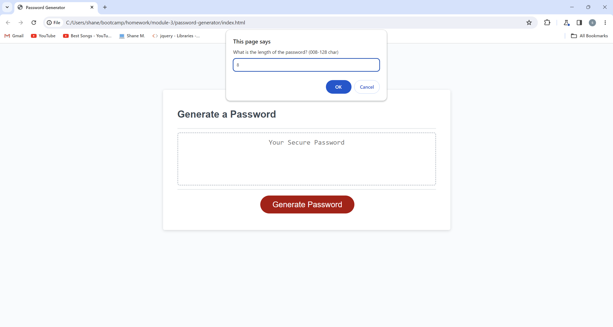
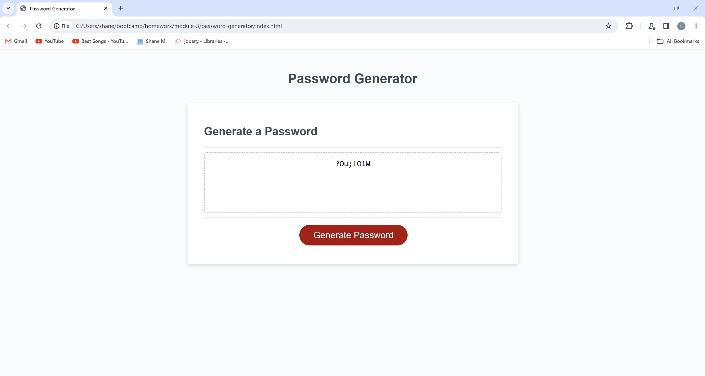

# password-generator

## This is an application that enables employees to generate random passwords based on criteria that they’ve selected such as lowercase, uppercase, numbers, and/or special characters. This app will run in the browser and will feature dynamically updated HTML and CSS powered by JavaScript code that you write. It will have a clean and polished, responsive user interface that adapts to multiple screen sizes.

From this project I learned how to operate a random number generator and how to better utilize array methods.

## Usage

Upon clikcing the button, the user will be prompted to type in a number for the length of their desired password. That will be followed by four more prompts asking what types of characters should be included in the password. The user's new password will then be written in the display box.

## Credits

The base code was provided by Columbia Engineering Coding Boot Camp.

## License

MIT License.
